# Module 2 Group Assignment

CSCI 5117, Spring 2022, [assignment description](https://canvas.umn.edu/courses/355584/pages/project-2)

## App Info:

* Team Name: The Runtime Terrors
* App Name: Chore-a-saurus
* App Link: https://main--incredible-tulumba-63afdc.netlify.app/

### Students

* Pratik Nehete, nehet001@umn.edu
* Anoushka Sunkum, sunku005@umn.edu
* John Lei, lei00007@umn.edu
* Brandon Weinstein, weins127@umn.edu
* Sarah Kollodge, kollo025@umn.edu

## Key Features

**Describe the most challenging features you implemented
(one sentence per bullet, maximum 4 bullets):**

* Parent and child account separate functionality
* Linking child and parent accounts through pin creation and storage
* Push notifications

Which (if any) device integration(s) does your app support?

* Camera

Which (if any) progressive web app feature(s) does your app support?

* Push notifications

## Mockup images

LINK TO LOW_FIDELITY MOCK_UPS: https://www.figma.com/file/giJnNbf3UK2Fl20W4A3LiA/Project-2?node-id=0-1&t=7nftTO4VlO5hJRVG-0

## *Login page*
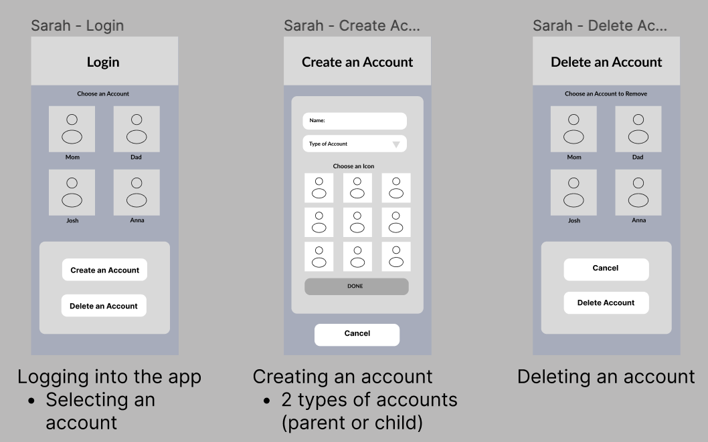

## *Home page or View task page*
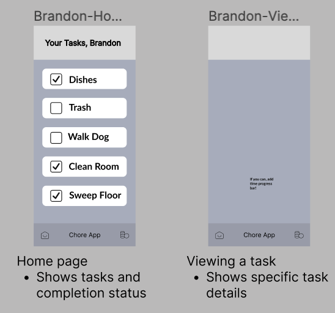

## *Add or Edit task page*
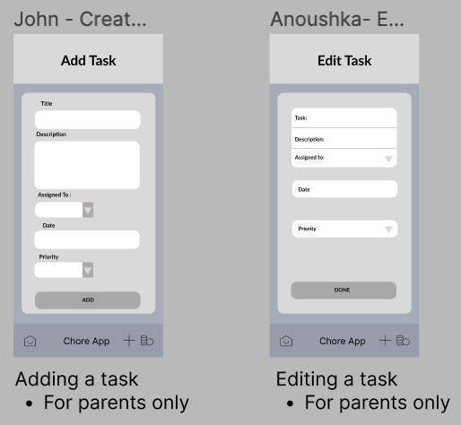

## *Analytics page*
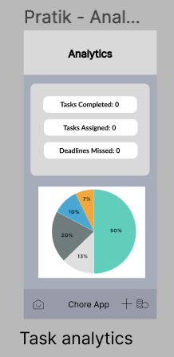

## Testing Notes

**Is there anything special we need to know in order to effectively test your app? (optional):**

* Need to enable push notifications in browser or mobile to allow for them to be sent
* Click the bell in the navigation bar to enable push notifications. Then, either click allow push notifications in the popup that appears, or manually enable push notifications in settings. After this, push notifications should be sent to your device.

## Screenshots of Site
## *Home*
The parent and child home pages include a list of chores as well as being able to click a chore to see further details. There are filters in place as well to filter the chores by status and priority.

Parent
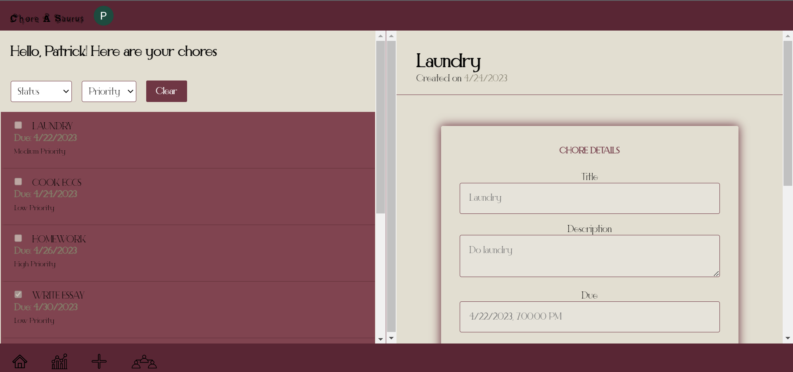

Child
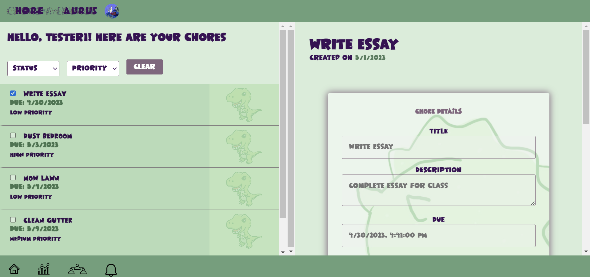

## *Chore Information*
The parent and child chore pages shows information on each individual chore. There are options to edit, delete, notify, and mark as complete on either side respectively.

Parent
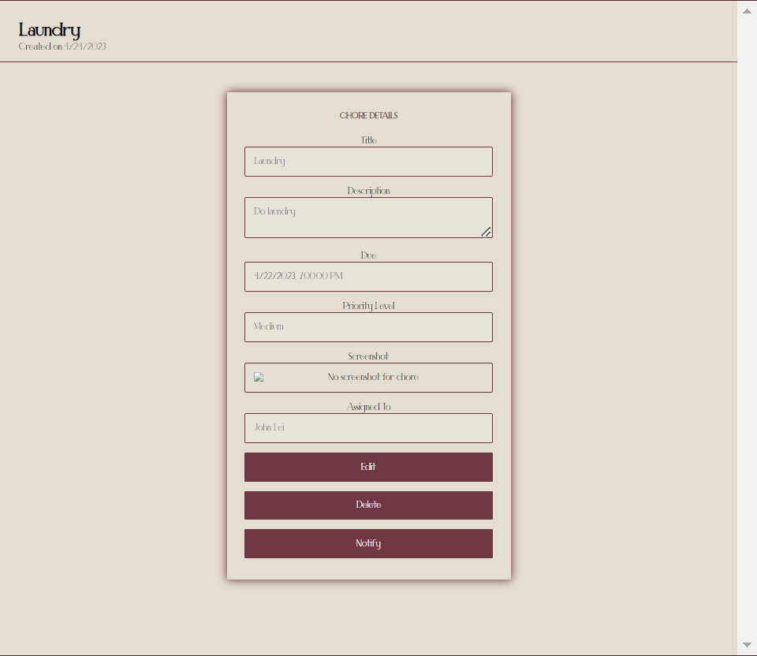

Child
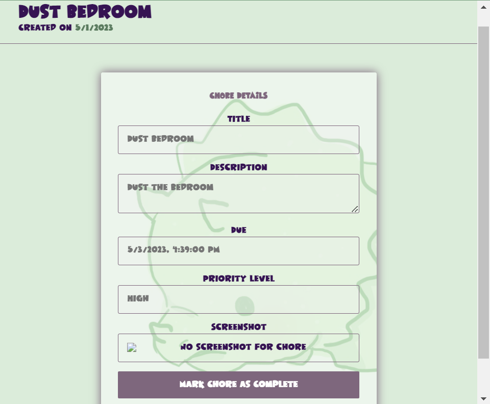

## *Add Chore*
This page allows only the parent to add a new chore to any of their connected children.

Parent
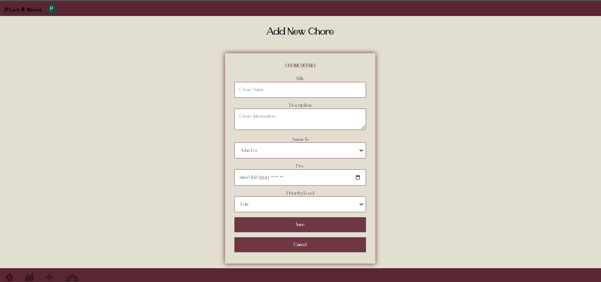

## *Edit Chore*
This page allows only the parent to edit chores tied to any of their connected children.

Parent
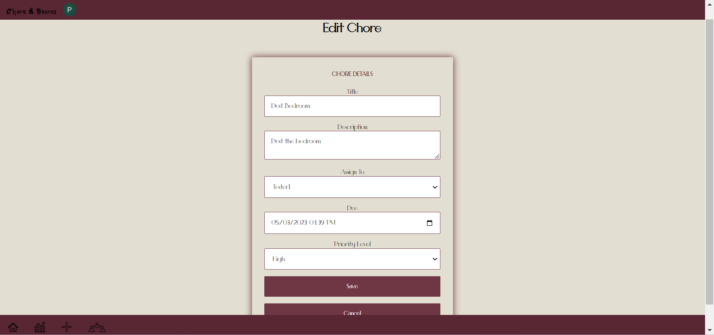

## *Completed Chore*
These pages allow a child to submit a completed chore alongside a picture of it.

Child - Default page
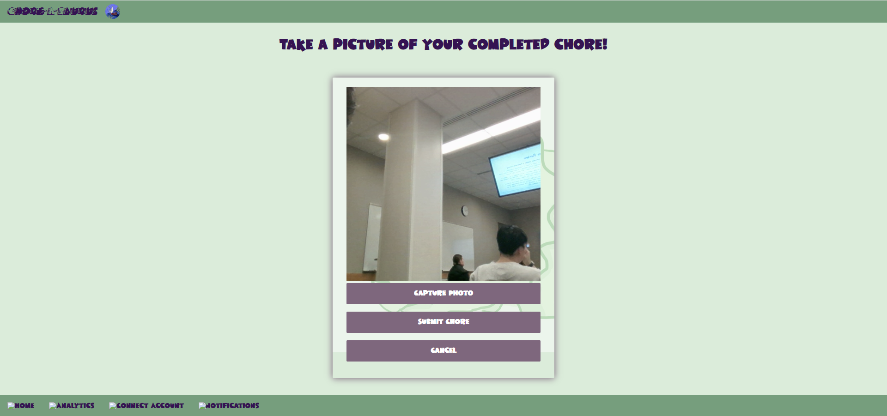

Child - Completed chore page after submission
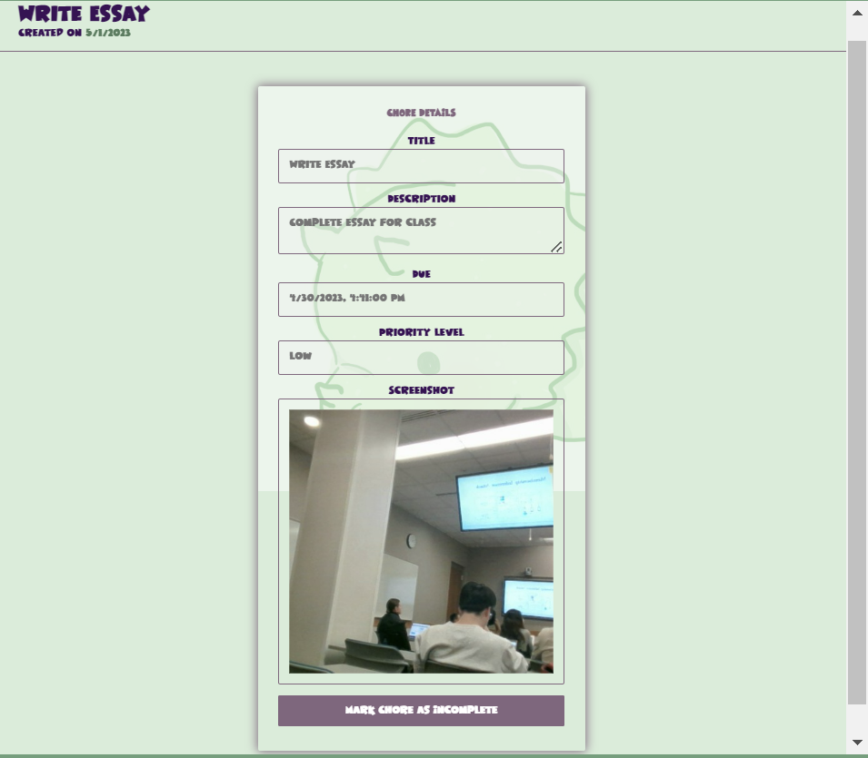

## *Connect Pin*
These pages allow a parent to input a child's generated pin to connect their accounts together.

Parent - Default Screen
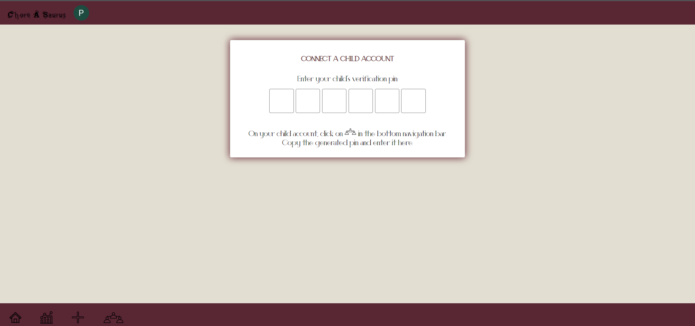

Parent - After connecting child
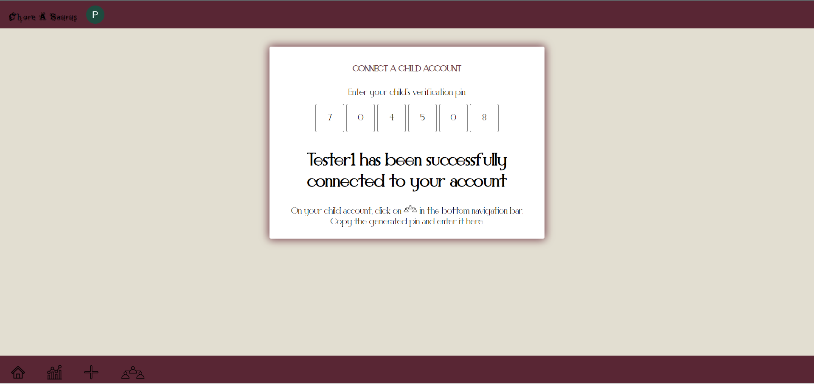

Child
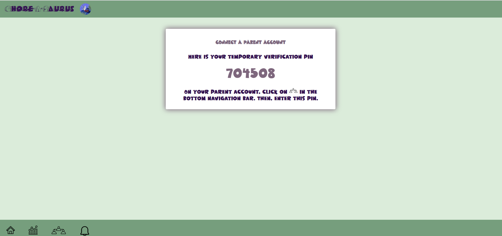

## *Analytics*
These pages allow for metrics to be tracked of chores completed. A pie chart visualization has also been incorporated.

Parent
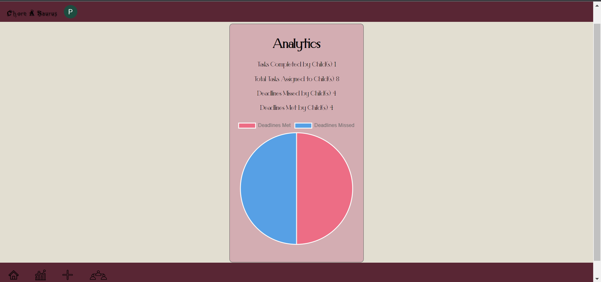

Child
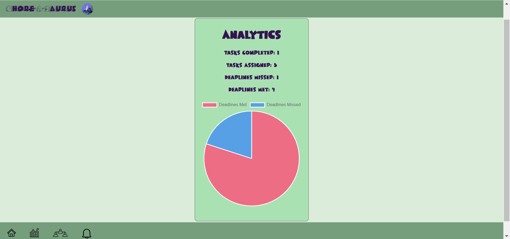

## *Signin*
The clerk default signin page.

Clerk
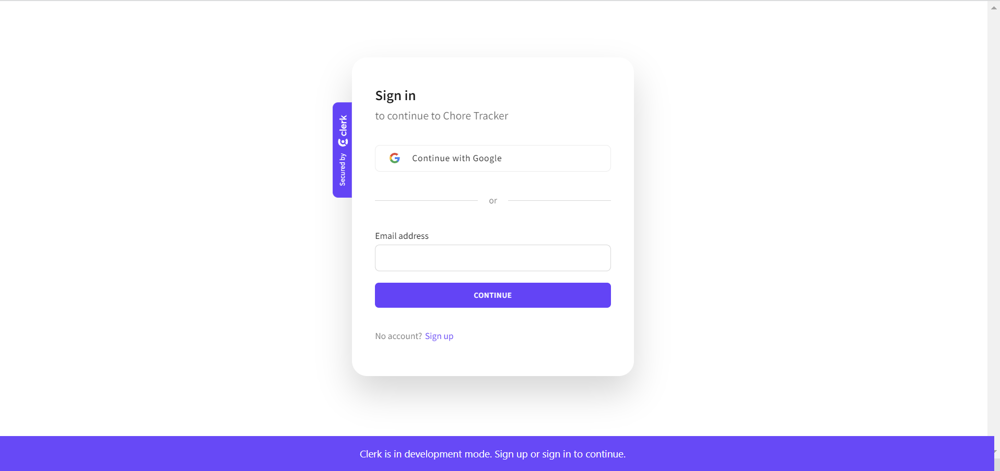

## External Dependencies

**Document integrations with 3rd Party code or services here.
Please do not document required libraries (e.g., Vue, Vuefire, Firebase).**

* web-push: Used this for our push notifications system

**If there's anything else you would like to disclose about how your project
relied on external code, expertise, or anything else, please disclose that
here:**

* The pushBackend folder is a separate backend that handles our push notification system. Dependencies for this include web-push, dotenv, node-cron, and node-fetch.

# Setting Up:

Run the development server:
- npm run dev

## Installs for backend/codehooks
- npm install codehooks-js codehooks-crudlify
- npm install jwt-decode
- npm install yup

## Installs for extra react packages
- npm install react-pin-input
- npm install react-webcam

## Installs for charts
- npm install chart.js

## Installs for auth/clerk
- npm install @clerk/nextjs

## Installs anime
- npm install animejs
*** Note: This install might need to be run with flag 
--legacy-peer-deps if standard install doesn't work

## Backend commands
In /backend: 
- coho deploy
- coho info

# Icons - Attribution:

Home by Jokoy from <a href="https://thenounproject.com/browse/icons/term/home/" target="_blank" title="Home Icons">Noun Project</a>

analytics by BomSymbols from <a href="https://thenounproject.com/browse/icons/term/analytics/" target="_blank" title="analytics Icons">Noun Project</a>

add by Uswah Studio from <a href="https://thenounproject.com/browse/icons/term/add/" target="_blank" title="add Icons">Noun Project</a>

connect by roughen.line from <a href="https://thenounproject.com/browse/icons/term/connect/" target="_blank" title="connect Icons">Noun Project</a>
