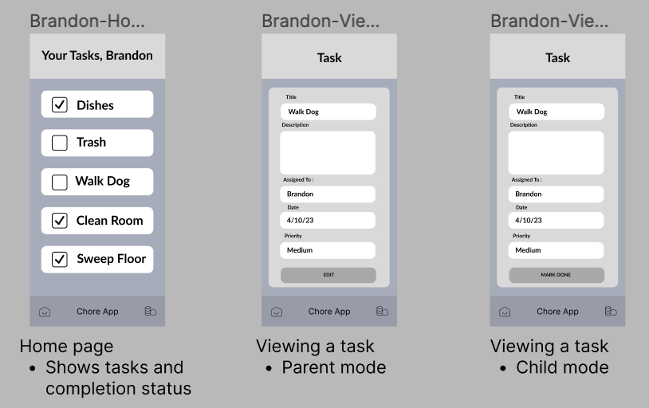

# Module 2 Group Assignment

CSCI 5117, Spring 2022, [assignment description](https://canvas.umn.edu/courses/355584/pages/project-2)

## App Info:

* Team Name: The Runtime Terrors
* App Name: TBD
* App Link: <https://TODO.com/>

### Students

* Pratik Nehete, nehet001@umn.edu
* Anoushka Sunkum, sunku005@umn.edu
* John Lei, lei00007@umn.edu
* Brandon Weinstein, weins127@umn.edu
* Sarah Kollodge, kollo025@umn.edu

## Key Features

**Describe the most challenging features you implemented
(one sentence per bullet, maximum 4 bullets):**

* ...

Which (if any) device integration(s) does your app support?

* ...

Which (if any) progressive web app feature(s) does your app support?

* ...

## Mockup images

LINK TO LOW_FIDELITY MOCK_UPS: https://www.figma.com/file/giJnNbf3UK2Fl20W4A3LiA/Project-2?node-id=0-1&t=7nftTO4VlO5hJRVG-0

**[Add images/photos that show your mockup](https://stackoverflow.com/questions/10189356/how-to-add-screenshot-to-readmes-in-github-repository) along with a very brief caption:**

Login page

Home page or View task page

Home page or View task page

Add or Edit task page

Analytics page

## Testing Notes

**Is there anything special we need to know in order to effectively test your app? (optional):**

* ...

## Screenshots of Site (complete)

**[Add a screenshot of each key page](https://stackoverflow.com/questions/10189356/how-to-add-screenshot-to-readmes-in-github-repository)
along with a very brief caption:**

## External Dependencies

**Document integrations with 3rd Party code or services here.
Please do not document required libraries (e.g., Vue, Vuefire, Firebase).**

* Library or service name: description of use
* ...

**If there's anything else you would like to disclose about how your project
relied on external code, expertise, or anything else, please disclose that
here:**

...
